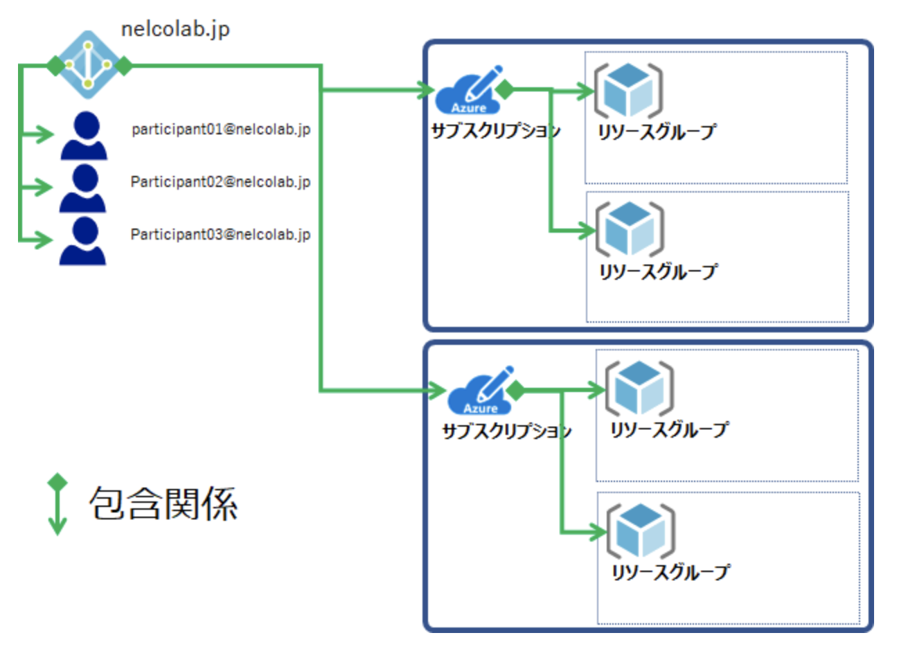
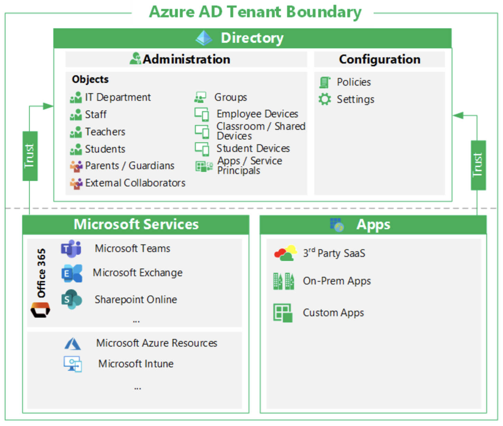
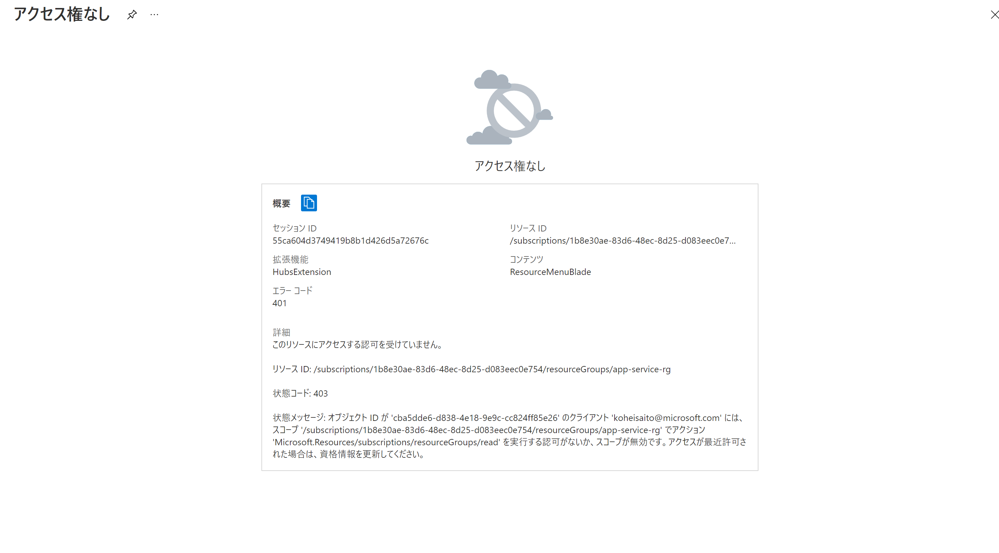

# Azure AD

## Azure Active Directory とは

Microsoft が提供するクラウドベースの ID & Access Management サービス。
以下のリソースへのサインインとアクセスを支援する。

- Microsoft 365, Azure Portal, 各種 SaaS アプリケーション、外部リソース
- 企業ネットワークとイントラネット状のアプリケーションや、自分が属する組織で開発したクラウドアプリケーションなどの内部リソース

## Azure AD のライセンス

Microsoft 365 や、 Microsoft Azure の使用開始時に、自動的に Azure AD が提供され、全ての無料機能を利用できるようになる。
Azure AD の実装を強化するために、 Azure Active Directory Premium P1 ライセンスや、Premium P2 ライセンスにアップグレードして、有料機能を追加することも可能。

| ライセンス | 概要 |
| :--- | :--- |
| Azure Active Directory Free | ユーザーとグループの管理、オンプレミス ディレクトリ同期、基本レポート、クラウド ユーザー向けのセルフサービスのパスワード変更のほか、Azure、Microsoft 365、および多くの一般的な SaaS アプリ全体のシングル サインオンを提供する。 |
| Azure Active Directory Premium P1 | 無料で使用できる機能に加え、動的グループ、セルフサービスグループ管理、Microsoft Identity Manager (OnP の ID & Access Management サービス)、OnP ユーザによるセルフサービスパスワードリセットを可能にするクラウドの書き戻し機能をサポート。 |
| Azure Active Directory Premium P2 | Free および P1 の機能に加え、リスクベースの条件付きアクセスを提供する Azure Active Directory Identity Protection 、管理者と管理者によるリソースのアクセスを統制し、 JIT Access を提供する Privileged Identity Management が提供される。 |
Pay as you go | Azure AD B2C などの管理ライセンスを別途取得することも可能。|

これらのライセンスは、<b>ユーザライセンス（ユーザ単位のライセンス）であり、テナントレベルのライセンスではない。</b>そのため、月額費用は下記のような計算式になる。

<blockquote>Azure AD エディションの月額料金 × Azure AD ユーザ数</blockquote>

従量課金の Azure Subscription と、 Azure AD のユーザライセンスは、完全に異なる契約形態であるため、 Azure AD  Subscription の費用に Azure AD のユーザライセンス料が加算されることはない。請求書も別々に発行される（Exchange Online や SharePoint Online などの Office 365 もユーザライセンスである）。

購入したAzure AD のライセンスは、 Azure AD ユーザに割り当てる。その際、 1 人 1 人に直接割り当てることもできる（直接割り当て）が、ユーザが属するグループに間接的に割り当てることも可能（間接割り当て）。<b>ただし、グループへのライセンス割り当てには、 Azure AD Premium P1 ライセンスが必要。</b><br>
Azure AD ライセンスは、単体での購入のほか、「Enterprise Mobility + Security (EMS)」や「Microsoft 365」などのライセンスパッケージで購入することも可能。

## Azure AD 全体像

Azure AD にはいくつかの概念がある。全体像を把握するには、以下の図を用いて理解するのが良い。



（[Azureの基本!
Azure AD、サブスクリプション、リソースグループ位置関係と権限を再整理する -その1-](https://cloud.nissho-ele.co.jp/vdiblog/azuread_subscription_resourcegroups/)より引用）

Azure AD には様々な機能があるが、基本的な機能の一つとして、一つのテナントにおけるユーザ ID 認証基盤としての役割がある。

そもそもテナントとは、 <b>ID セキュリティ境界</b>のことを指す。セキュリティ境界内では、オブジェクト（ユーザ / アプリケーション）の管理とテナント全体の設定が制御される。



（[Azure ADテナントとは](https://docs.microsoft.com/ja-jp/microsoft-365/education/deploy/intro-azure-active-directory#what-is-an-azure-ad-tenant)より引用）

## Azure AD 外部 ID

Azure AD 内で外部 ID を使用すると、組織外のユーザに対して組織のアプリケーションとリソースへのアクセスを許可することができる。
ゲストユーザは、 BYOID (Bring Your Own IDentification) をすることが可能。

## Azure AD 外部 ID のシナリオ

Azure AD B2B (企業間コラボレーション)、Azure AD B2C (企業 - Consumer) の 2 つのシナリオをサポートする。

### 外部ユーザとアプリケーションやリソースを共有する (Azure AD B2B)

外部ユーザを自分のテナントにゲストユーザとして招待する。

ゲストユーザ は外部ユーザなので、招待した Azure AD テナント内からは、`#EXT#` がユーザオブジェクトに付与される。

<blockquote>xxxxxx_xxxxxx.com#EXT#@xxxxxxxxxxx.onmicrosoft.com</blockquote>

ゲストユーザは、 `User type` プロパティが `Guest` になる（メンバーユーザの `User type` は `Member` である）。

ゲストユーザは、デフォルトでは何もロールを持っていない。そのため、ロールを付与されないまま、ゲストユーザで招待先のディレクトリにログインをし、リソースを参照しようと試みても、 401 / 403 エラーが返ってくる。ゲストユーザに対して、招待先のアカウントで適切なロールを付与する必要がある。ゲストユーザにロールを付与する方法は、[こちら](https://docs.microsoft.com/ja-jp/azure/role-based-access-control/role-assignments-external-users#assign-a-role-to-a-guest-user)を参照すること（管理グループ単位、サブスクリプション単位、リソースグループ単位、リソース単位など、適切なスコープでロールを設定可能）。



### Azure AD B2C

B2C の ID が提供される。 Consumer は、Twitter や Facebook など、好みの SNS アカウントを使用してログインが可能になる。

認証プラットフォームのスケーリングも可能であり、 DoS やブルートフォース攻撃などの監視も行う。

裏側では、 OpenID Connect や OAuth 2.0、SAML が使われており、他のソフトウェアやアプリケーションとの統合も可能。

#### Azure AD B2C の技術概要

以下、Azure AD B2C における技術概要をまとめる。

##### Azure AD B2C テナント

Azure AD B2C において、テナントは組織を表している。また、既存の Azure AD のテナントとは別物である。

Azure AD B2C で使用する主なリソースは下記の通り。

- ディレクトリ
Azure AD B2C によって、ユーザの資格情報、アプリケーションの登録情報などが保存される場所。

- アプリケーションの登録
Azure AD B2C を使うためには、アプリケーションをあらかじめ Azure AD B2C に登録しておく必要がある。

- ユーザーフロー
アプリケーション内部で、サインアップ・サインイン・プロファイル編集などの組み込みを行うために、ユーザーフローを設定する。

- カスタムポリシー
複雑な ID フローには、カスタムポリシーを設定する。

-  ID プロバイダー
ID を発行するプロバイダー。 Facebook や Google など。

- キー
クライアントシークレットや証明書などを暗号化する際に使用する暗号化キー。

##### Azure AD B2C アカウント種別

Azure AD B2C において提供されるアカウントには下記のような種別がある。

| 種別 | 概要 |
| :--- | :--- |
| 職場アカウント | 「中の人」、というイメージ。 |
| ゲストアカウント | 職場アカウントによって招待された外部ユーザ。 |
| コンシューマアカウント | 一般ユーザ。 Azure AD B2C ユーザーフロー によって管理される。Azure Portal など Azure のリソースにはアクセスできない。 |

（参考：[Azure AD B2C のアカウント](https://docs.microsoft.com/ja-jp/azure/active-directory-b2c/technical-overview#accounts-in-azure-ad-b2c)）

##### Azure AD B2C サンプルアプリケーション

サンプルアプリケーションとして、 [Microsoft が公開しているもの](https://github.com/Azure-Samples/ms-identity-b2c-javascript-spa)を使用した。

```powershell
$ npm install & npm update
$ npm start

Listening on port 6420...
```

Just access to [http://localhost:6420](http://localhost:6420) and Sign in or Sign up.

## ディレクトリ間のリソースの移動

リソースを移動する際は、異なるサブスクリプション配下へはサポートされているが、移動元・移動先のサブスクリプションの Azure AD のテナントが同一である（ディレクトリを揃える）必要がある。（[参考](https://jpaztech1.z11.web.core.windows.net/%E3%82%B5%E3%83%96%E3%82%B9%E3%82%AF%E3%83%AA%E3%83%97%E3%82%B7%E3%83%A7%E3%83%B3%E9%96%93%E3%81%AE%E3%83%AA%E3%82%BD%E3%83%BC%E3%82%B9%E7%A7%BB%E5%8B%95.html)）

サブスクリプションを異なるディレクトリへ移動させる方法については、[こちら](https://docs.microsoft.com/ja-jp/azure/active-directory/fundamentals/active-directory-how-subscriptions-associated-directory)を参照すること。

## QA

- Azure AD P1 で使用できる「ハイブリッドユーザの OnP 、クラウド両方へのアクセス」とは、 OnP の認証も Azure AD で賄うことができる、という意味を指している？
    - https://docs.microsoft.com/ja-jp/azure/active-directory/fundamentals/active-directory-whatis#what-are-the-azure-ad-licenses
- 「OnP ユーザによるセルフサービスパスワードリセットを可能にするクラウドの書き戻し機能」とは、 OnP ユーザがクラウドユーザのパスワードを書き換えるのか？
    - https://docs.microsoft.com/ja-jp/azure/active-directory/fundamentals/active-directory-whatis#what-are-the-azure-ad-licenses
